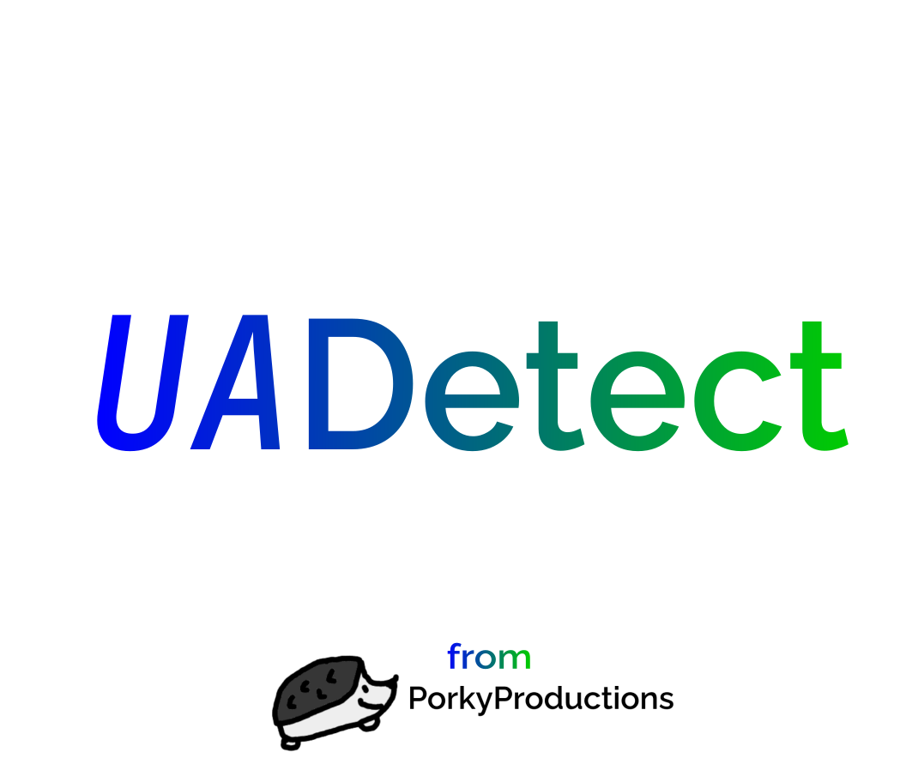
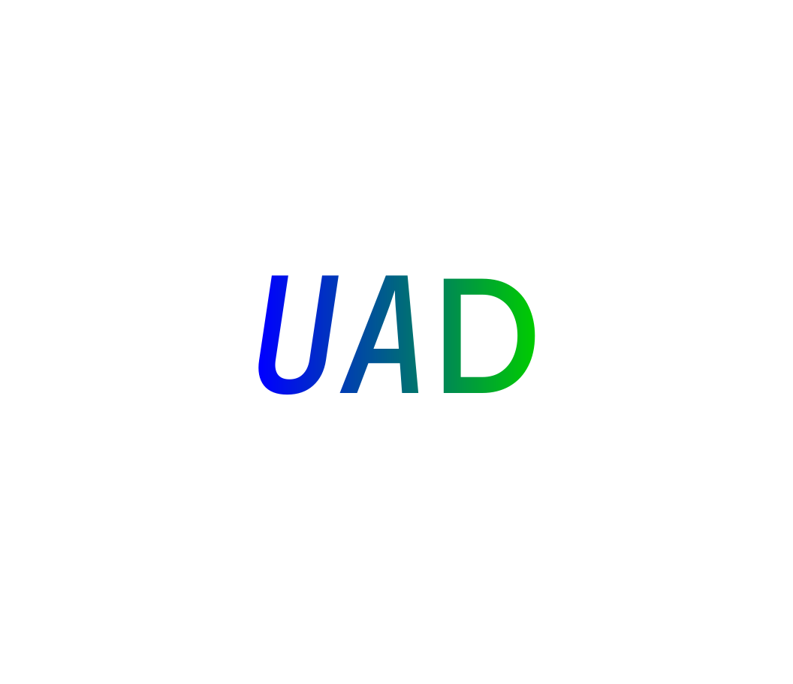

# UADetect



- [UADetect](#uadetect)
  - [Description](#description)
  - [Technologies Used](#technologies-used)
    - [Badges](#badges)
    - [Works On](#works-on)
  - [Installation](#installation)
    - [via `npm`](#via-npm)
  - [Documentation](#documentation)


## Description

✨The dead-simple way of interacting with the navigator API.✨

It may say "UA", but we're way more than that. UADetect is the eaisiet way to interact with the navigator API. We have lots of componets, and they all are well documented in the [docs](./docs/index.md).

## Technologies Used


### Badges

Proudly displaying every piece of technology this software has ever touched :)

                 

### Works On

     

## Installation
### via `npm`

Install the `uadetect` package

```bash
npm i -d uadetect
```


## Documentation

Read all about how to use the package in the [Docs](/docs/index.md)

